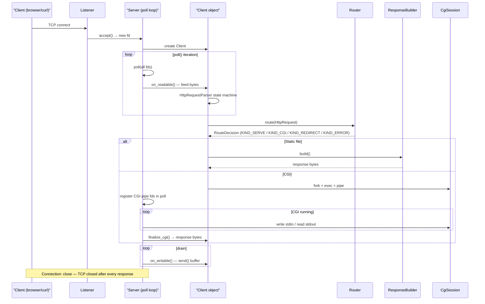
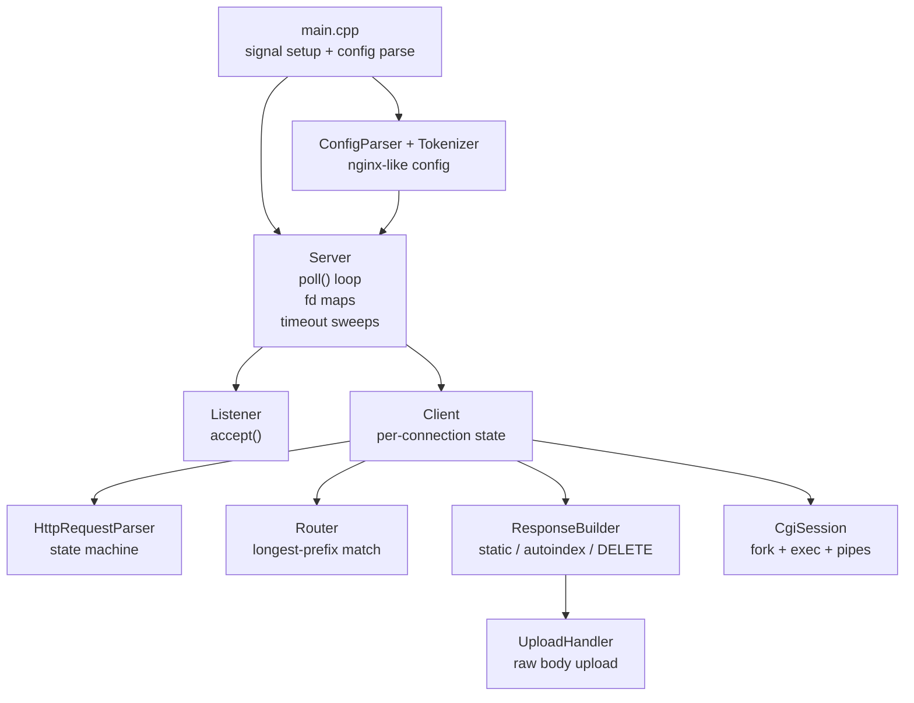
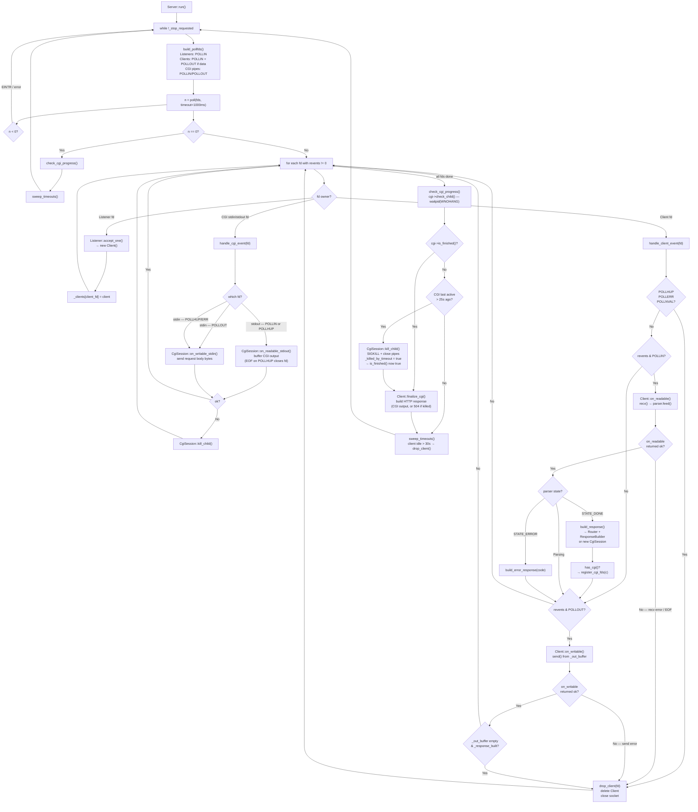
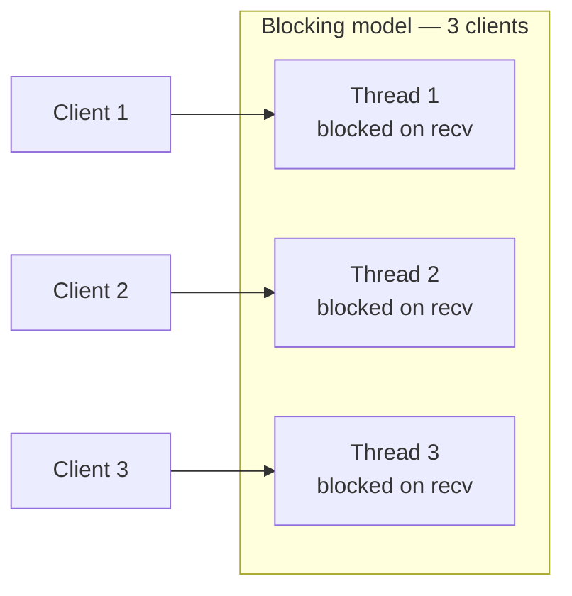
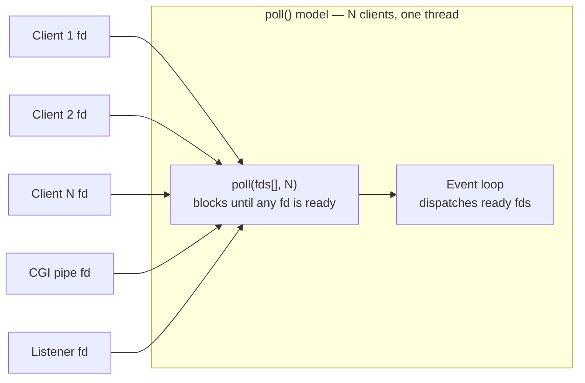
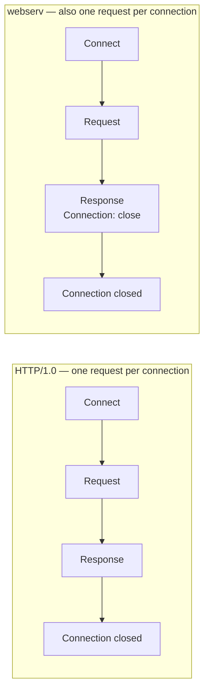
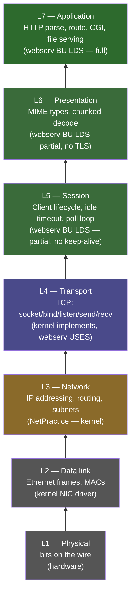
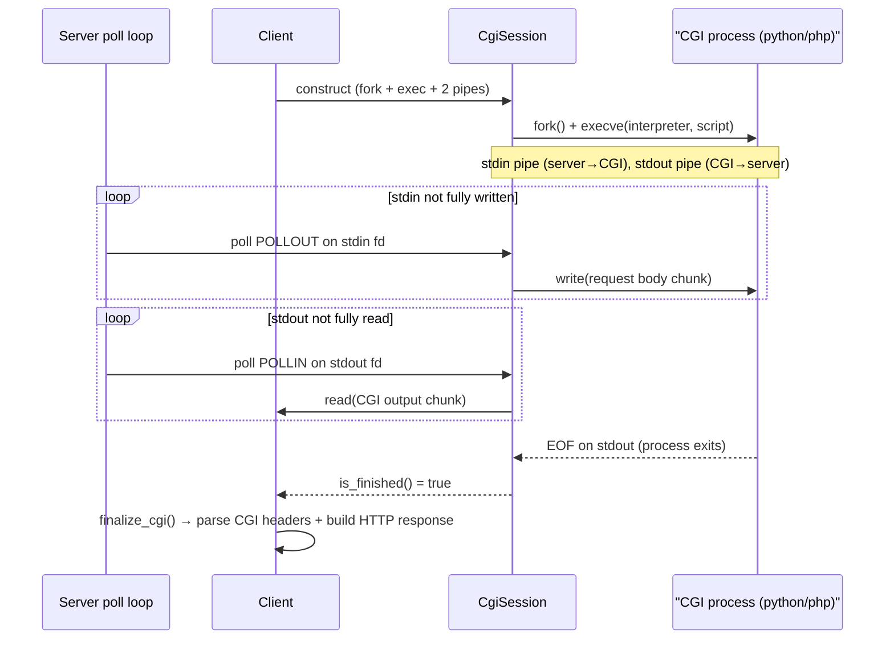

*This project has been created as part of the 42 curriculum by gansari and aelsetih (Ghazaleh Ansari and Ahmed Elsetiha).*

# webserv

---

## Description

webserv is a non-blocking HTTP/1.1 server written in C++98 from scratch, inspired by nginx. The goal is to understand how a real HTTP server works at the socket level — from accepting a TCP connection, parsing raw bytes into an HTTP request, routing to the right handler, and writing a well-formed response back — without relying on any networking library.

The server uses `poll()` for I/O multiplexing across all file descriptors — listening sockets, client connections, and CGI pipes — in a single event loop. It supports static file serving, directory listings, file uploads, configurable redirects, and CGI execution (Python, PHP, or any interpreter).

Configuration follows an nginx-like syntax: one or more `server` blocks, each with `location` sub-blocks for routing rules, upload directories, CGI extensions, and method restrictions.

---

## Table of Contents

- [Instructions](#instructions)
- [Architecture](#architecture)
- [Why poll()?](#why-poll)
- [HTTP/1.0 vs HTTP/1.1 — What webserv covers](#http10-vs-http11--what-webserv-covers)
- [OSI Model Mapping](#osi-model-mapping)
- [Configuration](#configuration)
- [CGI](#cgi)
- [Resources](#resources)

---

## Instructions

**Requirements:** `c++` (C++98), `make`, a POSIX system.

**Compilation:**

```bash
make        # compile → ./webserv binary
make re     # full rebuild
make clean  # remove obj/
make fclean # remove obj/ + binary
```

**Execution:**

```bash
./webserv configs/test.conf              # ports 8080 + 9090
./webserv configs/integration.conf       # ports 8080 + 8081
./webserv configs/upload.conf            # upload test
```

Config files live in `configs/`. Static content and CGI scripts live under `www/`. Stop the server with `Ctrl-C`.

---

## Architecture

The server is a single-process, event-driven loop with five layers.

### Request lifecycle



### Component map



### Event loop detail



---

## Why poll()?

The subject allows `select`, `poll`, `epoll`, and `kqueue` — any of them would satisfy the requirement. `poll()` was the deliberate choice, and here is why.

### The blocking alternative (one thread/process per connection)



- Each blocked thread consumes a kernel stack (~1–8 MB).
- Context-switch overhead grows with connection count.
- `fork()` is reserved for CGI only — spawning a process per request is not an option.

### poll() — single-process, event-driven



- One syscall monitors **all** fds simultaneously — listening sockets, client sockets, and CGI stdin/stdout pipes.
- No per-connection stack allocation. Memory scales O(1) per fd entry (`struct pollfd` = 8 bytes).
- No context switching between connection handlers.
- The subject mandates that **read/write may only happen after the multiplexer signals readiness** — this prevents blocking mid-request and starving other clients.

### select vs poll vs epoll vs kqueue — the tradeoffs

| | `select` | `poll` | `epoll` | `kqueue` |
|-|----------|--------|---------|----------|
| fd limit | 1024 (FD_SETSIZE) | unlimited | unlimited | unlimited |
| API | bit-mask, rebuilt each call | array, rebuilt each call | persistent interest set | persistent interest set |
| Event delivery | O(n) scan | O(n) scan | O(1) ready events | O(1) ready events |
| Portability | POSIX | POSIX | Linux-only | macOS/BSD-only |
| Extra setup | none | none | `epoll_create` + `ctl` | `kqueue` + `kevent` |

**Why `poll()` over the others:**
- `select` was ruled out immediately — the 1024 fd ceiling is a real limit under load.
- `epoll` and `kqueue` offer O(1) event delivery, but require more boilerplate and are platform-specific. The performance advantage only matters above thousands of simultaneous connections, which this project never approaches.
- `poll()` gives the fd-count freedom of `epoll` with POSIX portability and a simple array API. It rebuilds the `pollfd` array each iteration, which is the only meaningful cost — and for the connection counts typical in evaluation and stress testing, it is negligible.

---

## HTTP/1.0 vs HTTP/1.1 — What webserv covers



| Feature | HTTP/1.0 | HTTP/1.1 | webserv |
|---------|----------|----------|---------|
| **Persistent connections (keep-alive)** | No | Yes (default) | **No — every response sends `Connection: close` and the TCP connection is dropped** |
| **Request pipelining** | No | Yes | **No — one request per connection** |
| Host header mandatory | No | Yes | Enforced — HTTP/1.1 requests without `Host` are rejected with 400 |
| Chunked Transfer Encoding | No | Yes | Decoded — chunked request bodies are fully unchunked before routing/CGI |
| Content-Length enforcement | Required for bodies | Required or chunked | Enforced — bodies over `client_max_body_size` are rejected with 413 |
| Methods | GET, POST, HEAD | GET, POST, HEAD, PUT, DELETE, OPTIONS, TRACE | GET, POST, DELETE only — anything else returns 501 |
| Status codes | Basic | Full range | Full 2xx/3xx/4xx/5xx set with configurable custom error pages |
| 3xx redirects | No | Full | `return <code> <url>` per location block |
| Virtual hosts via `Host` header | No | Yes | **No — server config is fixed at accept() time by which port was used; Host header is validated but not used for routing** |
| HTTPS / TLS | No | No (separate layer) | Not implemented |
| HTTP/2 | No | No | Not implemented |

**What's implemented honestly:**

- HTTP/1.0 and HTTP/1.1 request lines are both accepted
- HTTP/1.1 Host header is required and validated
- Chunked request body decoding works
- All response headers say `HTTP/1.1` regardless of request version
- All responses include `Connection: close` — the server behaves like HTTP/1.0 in terms of connection lifecycle
- Request sizes are bounded: oversized request line/URI → 414, oversized header line or header section → 431, body over `client_max_body_size` → 413 (the per-location limit is honoured even when it raises the server default)
- Hardened against common attacks: URI path control characters (CR/LF) are kept percent-encoded to prevent HTTP response-splitting, and resolved filesystem paths are confined to the location root on both the static-serve **and** CGI paths (traversal escapes → 403)

---

## OSI Model Mapping

webserv lives at the application layer. The kernel provides everything below.



**Defense framing:** NetPractice answers *"how does a packet find the right machine?"* (L3). webserv answers *"once bytes land in my socket, how do I turn them into HTTP?"* (L7). The socket API at L4 is the seam where the kernel hands off to application code.

The OSI model is a teaching abstraction — real networking collapses L5/L6/L7 into a single application layer (TCP/IP model).

---

## Configuration

nginx-style config files. One or more `server` blocks, each with `location` sub-blocks.

```nginx
server {
    listen 8080;
    host 127.0.0.1;
    server_name example.com www.example.com;
    client_max_body_size 1m;
    error_page 404 /errors/404.html;
    error_page 500 502 503 504 /errors/5xx.html;

    location / {
        root www;
        index index.html;
        methods GET POST DELETE;
        autoindex on;
    }

    location /upload {
        root www;
        methods POST DELETE;
        upload_store www/uploads;
        client_max_body_size 10m;
    }

    location /cgi-bin {
        root www;
        methods GET POST;
        cgi_extension .py /usr/bin/python3;
        cgi_extension .php /usr/bin/php-cgi;
    }

    location /old {
        return 301 /new;
    }
}
```

Size suffixes: `k`/`K` (kilobytes), `m`/`M` (megabytes). Location matching uses longest-prefix wins (no regex). Each `listen` port runs its own independent server config — the `server_name` directive is parsed but not used to select between configs at request time.

---

## CGI



- CGI is triggered by file extension (`.py`, `.php`, etc.) per location.
- Chunked request bodies are unchunked before being piped to the CGI process.
- CGI stdout is read until EOF; `Content-Length` is injected if the CGI did not provide one.
- CGI processes time out after 25 seconds → 504 response.
- Environment variables set: `GATEWAY_INTERFACE`, `SERVER_PROTOCOL`, `SERVER_SOFTWARE`, `REQUEST_METHOD`, `QUERY_STRING`, `CONTENT_LENGTH`, `SCRIPT_FILENAME`, `SCRIPT_NAME`, `SERVER_NAME`, `SERVER_PORT`, `REDIRECT_STATUS` (always `200`, required by php-cgi), plus all request headers forwarded as `HTTP_*` variables.
- `CONTENT_TYPE` is forwarded only when the request includes a `Content-Type` header.
- `PATH_INFO` is always empty (not parsed from URI). `REMOTE_ADDR`/`REMOTE_HOST` are always empty (peer address is not tracked).

---

## Resources

### Documentation & specifications

- [MDN — Evolution of HTTP](https://developer.mozilla.org/en-US/docs/Web/HTTP/Guides/Evolution_of_HTTP) — HTTP/1.0 → HTTP/1.1 → HTTP/2 history and feature comparison
- [POSIX poll()](https://pubs.opengroup.org/onlinepubs/009696799/functions/poll.html) — official poll() specification
- [listen(2) — Linux man page](https://linux.die.net/man/2/listen) — socket listening syscall reference
- [IBM Docs — CGI](https://www.ibm.com/docs/en/i/7.6.0?topic=functionality-cgi) — CGI protocol specification
- [IBM Docs — setsockopt](https://www.ibm.com/docs/en/zos/3.1.0?topic=instructions-setsockopt) — socket option reference
- [Transport Layer Security — Codecademy](https://www.codecademy.com/article/transport-layer-security) — explains TLS/SSL, the L6 encryption layer this server does not implement

### Articles & tutorials

- [Non-Blocking Sockets and I/O Multiplexing with epoll in C — Medium](https://medium.com/@hajorda/non-blocking-sockets-and-i-o-multiplexing-with-epoll-in-c-bd3d8e54c20a) — conceptual bridge between poll and epoll; useful for understanding event-driven I/O
- [Sockets and Network Programming in C — codequoi](https://www.codequoi.com/en/sockets-and-network-programming-in-c/) — practical walkthrough of the socket API used throughout this project
- [C++ Socket Programming — TutorialsPoint](https://www.tutorialspoint.com/cplusplus/cpp_socket_programming.htm) — socket fundamentals in C++
- [Inside NGINX: How We Designed for Performance & Scale](https://blog.nginx.org/blog/inside-nginx-how-we-designed-for-performance-scale) — the architectural model this project is inspired by
- [Practical Nginx — a Beginner's Step-by-Step Guide](https://mohammadtaheri.medium.com/practical-nginx-a-beginners-step-by-step-project-guide-6f4c7540c06f) — understanding nginx config structure, which informed the config parser design
- [The Evolution of HTTP 1.0 vs 1.1 vs 2.0 — Leapcell / Medium](https://leapcell.medium.com/the-evolution-of-http-1-0-vs-1-1-vs-2-0-a-clear-comparison-3948217adc97) — clear feature comparison table between HTTP versions
- [Common Gateway Interface (CGI) — GeeksforGeeks](https://www.geeksforgeeks.org/computer-networks/common-gateway-interface-cgi/) — CGI protocol explained
- [Layers of OSI Model — GeeksforGeeks](https://www.geeksforgeeks.org/computer-networks/open-systems-interconnection-model-osi/) — OSI layer definitions and PDU table
- [Transmission Control Protocol (TCP) — GeeksforGeeks](https://www.geeksforgeeks.org/computer-networks/what-is-transmission-control-protocol-tcp/) — TCP as it relates to the socket layer this server uses
- [Proxy vs Reverse Proxy vs Load Balancer — YouTube](https://www.youtube.com/watch?v=xo5V9g9joFs) — context for where an HTTP server sits in an infrastructure
- [NGINX Explained — YouTube](https://www.youtube.com/watch?v=iInUBOVeBCc) — conceptual overview of nginx architecture
- [webserv: Building a Non-Blocking Web Server in C++98 — Medium](https://m4nnb3ll.medium.com/webserv-building-a-non-blocking-web-server-in-c-98-a-42-project-04c7365e4ec7) — another 42 student's writeup; useful for cross-referencing design decisions

### Worth knowing

- [RFC 7230 — HTTP/1.1 Message Syntax and Routing](https://datatracker.ietf.org/doc/html/rfc7230) — the authoritative spec for request parsing, chunked encoding, and keep-alive semantics
- [RFC 3875 — CGI/1.1](https://datatracker.ietf.org/doc/html/rfc3875) — the CGI specification; defines required environment variables and the response format
- [Beej's Guide to Network Programming](https://beej.us/guide/bgnet/) — the classic hands-on reference for POSIX socket programming in C

### AI usage

Claude (Anthropic) was used during this project for:

- **Debugging** — diagnosing poll edge cases, CGI timeout logic, and chunked encoding parser bugs.
- **Code review** — refactoring `CgiSession`, `HttpRequestParser`, and the `Router` for clarity.
- **Documentation** — this README was refined with AI assistance.

AI was not used to generate the core server logic wholesale — all design decisions, implementation choices, and the final code are the author's own.
