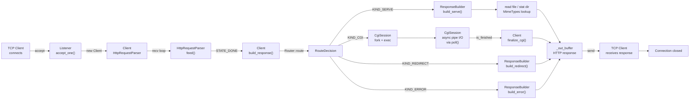

# Data Flow Overview

End-to-end flow from TCP connection to HTTP response.

```mermaid
flowchart LR
    A["TCP Client\nconnects"] -->|accept| B["Listener\naccept_one()"]
    B -->|new Client| C["Client\nHttpRequestParser"]
    C -->|recv loop| D["HttpRequestParser\nfeed()"]
    D -->|STATE_DONE| E["Client\nbuild_response()"]
    E -->|Router::route| F["RouteDecision"]

    F -->|KIND_SERVE| G["ResponseBuilder\nbuild_serve()"]
    F -->|KIND_CGI| H["CgiSession\nfork + exec"]
    F -->|KIND_REDIRECT| I["ResponseBuilder\nbuild_redirect()"]
    F -->|KIND_ERROR| J["ResponseBuilder\nbuild_error()"]

    G --> K["read file / stat dir\nMimeTypes lookup"]
    H --> L["CgiSession\nasync pipe I/O\nvia poll()"]
    L -->|is_finished| M["Client\nfinalize_cgi()"]

    K --> N["_out_buffer\nHTTP response"]
    M --> N
    I --> N
    J --> N

    N -->|send| O["TCP Client\nreceives response"]
    O --> P["Connection closed"]
```
