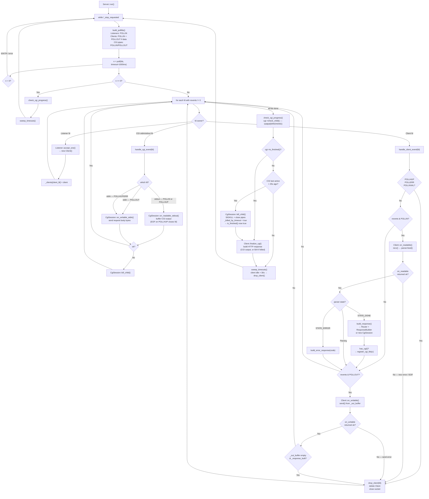

# Server Poll Loop

`Server::run()` — the main event loop driving all I/O.

```mermaid
flowchart TD
    START["Server::run()"] --> LOOP["while !_stop_requested"]

    LOOP --> BUILD["build_pollfds()\nListeners: POLLIN\nClients: POLLIN + POLLOUT if data\nCGI pipes: POLLIN/POLLOUT"]
    BUILD --> POLL["n = poll(fds, timeout=1000ms)"]

    POLL --> EINTR{"n < 0?"}
    EINTR -->|EINTR / error| LOOP

    POLL --> TIMEOUT{"n == 0?"}
    TIMEOUT -->|Yes| CGI0["check_cgi_progress()"]
    CGI0 --> SWEEP0["sweep_timeouts()"]
    SWEEP0 --> LOOP

    TIMEOUT -->|No| ITER["for each fd with revents != 0"]

    ITER --> TYPE{"fd owner?"}

    TYPE -->|Listener fd| LACCEPT["Listener::accept_one()\n→ new Client()"]
    LACCEPT --> REG["_clients[client_fd] = client"]
    REG --> ITER

    TYPE -->|CGI stdin/stdout fd| CGIEV["handle_cgi_event(fd)"]
    CGIEV --> CGIPOLL{"which fd?"}
    CGIPOLL -->|stdout — POLLIN or POLLHUP| RSTDOUT["CgiSession::on_readable_stdout()\nbuffer CGI output\n(EOF on POLLHUP closes fd)"]
    CGIPOLL -->|stdin — POLLOUT| WSTDIN["CgiSession::on_writable_stdin()\nsend request body bytes"]
    CGIPOLL -->|stdin — POLLHUP/ERR| WSTDIN
    RSTDOUT --> OKCHECK{"ok?"}
    WSTDIN --> OKCHECK
    OKCHECK -->|No| KILLBAD["CgiSession::kill_child()"]
    OKCHECK -->|Yes| ITER
    KILLBAD --> ITER

    TYPE -->|Client fd| CLEV["handle_client_event(fd)"]
    CLEV --> ERR{"POLLHUP\nPOLLERR\nPOLLNVAL?"}
    ERR -->|Yes| DROP["drop_client(fd)\ndelete Client\nclose socket"]
    ERR -->|No| RCHECK{"revents & POLLIN?"}
    RCHECK -->|Yes| READ["Client::on_readable()\nrecv() → parser.feed()"]
    RCHECK -->|No| WCHECK
    READ --> READOK{"on_readable\nreturned ok?"}
    READOK -->|No — recv error / EOF| DROP
    READOK -->|Yes| PARSE{"parser state?"}
    PARSE -->|STATE_DONE| BUILD_RESP["build_response()\n→ Router + ResponseBuilder\nor new CgiSession"]
    BUILD_RESP --> REGCGI["has_cgi()?\n→ register_cgi_fds(c)"]
    REGCGI --> WCHECK
    PARSE -->|STATE_ERROR| ERR_RESP["build_error_response(code)"]
    PARSE -->|Parsing| WCHECK
    ERR_RESP --> WCHECK
    WCHECK{"revents & POLLOUT?"}
    WCHECK -->|Yes| WRITE["Client::on_writable()\nsend() from _out_buffer"]
    WRITE --> WRITEOK{"on_writable\nreturned ok?"}
    WRITEOK -->|No — send error| DROP
    WRITEOK -->|Yes| EMPTY{"_out_buffer empty\n& _response_built?"}
    EMPTY -->|Yes| DROP
    EMPTY -->|No| ITER
    WCHECK -->|No| ITER

    DROP --> ITER
    ITER -->|all fds done| CGIPROG["check_cgi_progress()\ncgi->check_child() — waitpid(WNOHANG)"]
    CGIPROG --> CGIDONE{"cgi->is_finished()?"}
    CGIDONE -->|Yes| FINALIZE["Client::finalize_cgi()\nbuild HTTP response\n(CGI output, or 504 if killed)"]
    CGIDONE -->|No| CGITIME{"CGI last active\n> 25s ago?"}
    CGITIME -->|Yes| KILL["CgiSession::kill_child()\nSIGKILL + close pipes\n_killed_by_timeout = true\n→ is_finished() now true"]
    CGITIME -->|No| SWEEP
    KILL --> FINALIZE
    FINALIZE --> SWEEP
    SWEEP["sweep_timeouts()\nclient idle > 30s → drop_client()"]
    SWEEP --> LOOP
```
