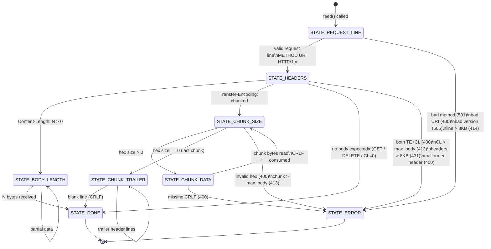
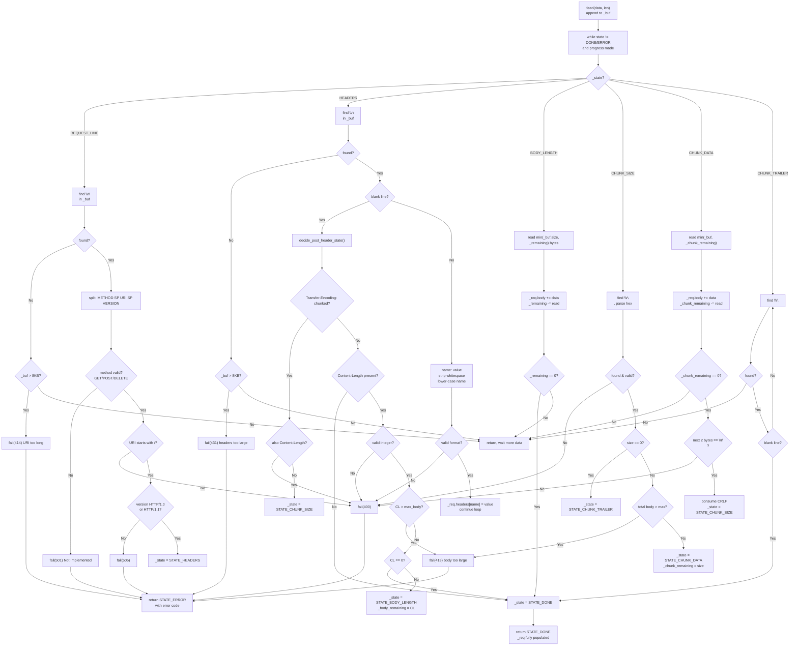

# HTTP Request Parser State Machine

`HttpRequestParser::feed()` — incremental, non-blocking state machine.

```mermaid
stateDiagram-v2
    [*] --> STATE_REQUEST_LINE : feed() called

    STATE_REQUEST_LINE --> STATE_HEADERS : valid request line\nMETHOD URI HTTP/1.x
    STATE_REQUEST_LINE --> STATE_ERROR : bad method (501)\nbad URI (400)\nbad version (505)\nline > 8KB (414)

    STATE_HEADERS --> STATE_BODY_LENGTH : Content-Length: N > 0
    STATE_HEADERS --> STATE_CHUNK_SIZE : Transfer-Encoding: chunked
    STATE_HEADERS --> STATE_DONE : no body expected\n(GET / DELETE / CL=0)
    STATE_HEADERS --> STATE_ERROR : both TE+CL (400)\nCL > max_body (413)\nheaders > 8KB (431)\nmalformed header (400)

    STATE_BODY_LENGTH --> STATE_DONE : N bytes received
    STATE_BODY_LENGTH --> STATE_BODY_LENGTH : partial data

    STATE_CHUNK_SIZE --> STATE_CHUNK_DATA : hex size > 0
    STATE_CHUNK_SIZE --> STATE_CHUNK_TRAILER : hex size == 0 (last chunk)
    STATE_CHUNK_SIZE --> STATE_ERROR : invalid hex (400)\nchunk > max_body (413)

    STATE_CHUNK_DATA --> STATE_CHUNK_SIZE : chunk bytes read\nCRLF consumed
    STATE_CHUNK_DATA --> STATE_ERROR : missing CRLF (400)

    STATE_CHUNK_TRAILER --> STATE_DONE : blank line (CRLF)
    STATE_CHUNK_TRAILER --> STATE_CHUNK_TRAILER : trailer header lines

    STATE_DONE --> [*]
    STATE_ERROR --> [*]
```

## Parsing Logic Per State

```mermaid
flowchart TD
    FEED["feed(data, len)\nappend to _buf"] --> LOOP["while state != DONE/ERROR\nand progress made"]

    LOOP --> SW{"_state?"}

    SW -->|REQUEST_LINE| RL["find \\r\\n in _buf"]
    RL --> RLF{"found?"}
    RLF -->|No| BIGBUF{"_buf > 8KB?"}
    BIGBUF -->|Yes| E414["fail(414) URI too long"]
    BIGBUF -->|No| WAIT["return, wait more data"]
    RLF -->|Yes| SPLIT["split: METHOD SP URI SP VERSION"]
    SPLIT --> VM{"method valid?\nGET/POST/DELETE"}
    VM -->|No| E501["fail(501) Not Implemented"]
    VM -->|Yes| VU{"URI starts with /?"}
    VU -->|No| E400["fail(400)"]
    VU -->|Yes| VV{"version HTTP/1.0\nor HTTP/1.1?"}
    VV -->|No| E505["fail(505)"]
    VV -->|Yes| GOTO_HDR["_state = STATE_HEADERS"]

    SW -->|HEADERS| HD["find \\r\\n in _buf"]
    HD --> HDF{"found?"}
    HDF -->|No| HDSIZE{"_buf > 8KB?"}
    HDSIZE -->|Yes| E431["fail(431) headers too large"]
    HDSIZE -->|No| WAIT
    HDF -->|Yes| BLANK{"blank line?"}
    BLANK -->|Yes| DECIDE["decide_post_header_state()"]
    BLANK -->|No| PARSE_H["name: value\nstrip whitespace\nlower-case name"]
    PARSE_H --> VALID_H{"valid format?"}
    VALID_H -->|No| E400
    VALID_H -->|Yes| STORE["_req.headers[name] = value\ncontinue loop"]
    DECIDE --> TE{"Transfer-Encoding: chunked?"}
    TE -->|Yes| ALSO_CL{"also Content-Length?"}
    ALSO_CL -->|Yes| E400
    ALSO_CL -->|No| GOTO_CHUNK["_state = STATE_CHUNK_SIZE"]
    TE -->|No| CL{"Content-Length present?"}
    CL -->|No| GOTO_DONE["_state = STATE_DONE"]
    CL -->|Yes| CLV{"valid integer?"}
    CLV -->|No| E400
    CLV -->|Yes| MAX{"CL > max_body?"}
    MAX -->|Yes| E413["fail(413) body too large"]
    MAX -->|No| ZERO{"CL == 0?"}
    ZERO -->|Yes| GOTO_DONE
    ZERO -->|No| GOTO_BODY["_state = STATE_BODY_LENGTH\n_body_remaining = CL"]

    SW -->|BODY_LENGTH| BL["read min(_buf.size, _remaining) bytes"]
    BL --> BLA["_req.body += data\n_remaining -= read"]
    BLA --> BLD{"_remaining == 0?"}
    BLD -->|Yes| GOTO_DONE
    BLD -->|No| WAIT

    SW -->|CHUNK_SIZE| CS["find \\r\\n, parse hex"]
    CS --> CSF{"found & valid?"}
    CSF -->|No| E400
    CSF -->|Yes| CSZ{"size == 0?"}
    CSZ -->|Yes| GOTO_TRAILER["_state = STATE_CHUNK_TRAILER"]
    CSZ -->|No| CSMAX{"total body > max?"}
    CSMAX -->|Yes| E413
    CSMAX -->|No| GOTO_DATA["_state = STATE_CHUNK_DATA\n_chunk_remaining = size"]

    SW -->|CHUNK_DATA| CD["read min(_buf, _chunk_remaining)"]
    CD --> CDA["_req.body += data\n_chunk_remaining -= read"]
    CDA --> CDZ{"_chunk_remaining == 0?"}
    CDZ -->|No| WAIT
    CDZ -->|Yes| CRLF{"next 2 bytes == \\r\\n?"}
    CRLF -->|No| E400
    CRLF -->|Yes| CONSUME["consume CRLF\n_state = STATE_CHUNK_SIZE"]

    SW -->|CHUNK_TRAILER| CT["find \\r\\n"]
    CT --> CTF{"found?"}
    CTF -->|No| WAIT
    CTF -->|Yes| CTB{"blank line?"}
    CTB -->|Yes| GOTO_DONE
    CTB -->|No| CT

    E400 --> DONE_ERR["return STATE_ERROR\nwith error code"]
    E413 --> DONE_ERR
    E414 --> DONE_ERR
    E431 --> DONE_ERR
    E501 --> DONE_ERR
    E505 --> DONE_ERR
    GOTO_DONE --> DONE_OK["return STATE_DONE\n_req fully populated"]
```
