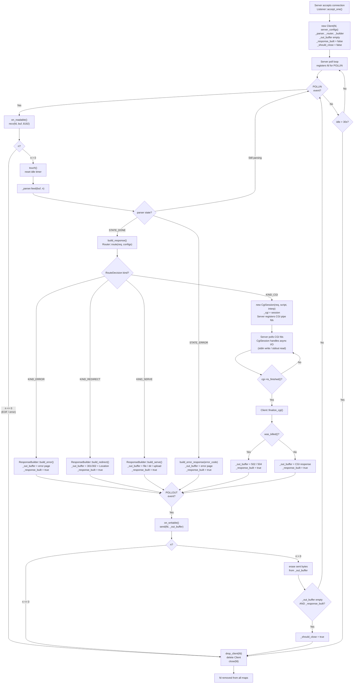

# Client Lifecycle

One `Client` per TCP connection. Driven entirely by poll events from `Server`.

```mermaid
flowchart TD
    ACCEPT["Server accepts connection\nListener::accept_one()"] --> NEW["new Client(fd, server_configs)\n_parser, _router, _builder\n_out_buffer empty\n_response_built = false\n_should_close = false"]

    NEW --> POLL["Server poll loop\nregisters fd for POLLIN"]

    POLL --> READ_EV{"POLLIN\nevent?"}

    READ_EV -->|Yes| RECV["on_readable()\nrecv(fd, buf, 8192)"]
    RECV --> RN{"n?"}
    RN -->|"n <= 0\n(EOF / error)"| DROP["drop_client(fd)"]
    RN -->|"n > 0"| TOUCH["touch()\nreset idle timer"]
    TOUCH --> FEED["_parser.feed(buf, n)"]
    FEED --> STATE{"parser state?"}

    STATE -->|STATE_DONE| ROUTE["build_response()\nRouter::route(req, configs)"]
    STATE -->|STATE_ERROR| ERR_R["build_error_response(error_code)\n_out_buffer = error page\n_response_built = true"]
    STATE -->|Still parsing| READ_EV

    ROUTE --> RDEC{"RouteDecision kind?"}

    RDEC -->|KIND_ERROR| RE["ResponseBuilder::build_error()\n_out_buffer = error page\n_response_built = true"]
    RDEC -->|KIND_REDIRECT| RR["ResponseBuilder::build_redirect()\n_out_buffer = 301/302 + Location\n_response_built = true"]
    RDEC -->|KIND_SERVE| RS["ResponseBuilder::build_serve()\n_out_buffer = file / dir / upload\n_response_built = true"]
    RDEC -->|KIND_CGI| CGI["new CgiSession(req, script, interp)\n_cgi = session\nServer registers CGI pipe fds"]

    RE --> WRITE_EV
    RR --> WRITE_EV
    RS --> WRITE_EV
    ERR_R --> WRITE_EV

    CGI --> CGIPOLL["Server polls CGI fds\nCgiSession handles async I/O\n(stdin write / stdout read)"]
    CGIPOLL --> CGIDONE{"cgi->is_finished()?"}
    CGIDONE -->|No| CGIPOLL
    CGIDONE -->|Yes| FINAL["Client::finalize_cgi()"]
    FINAL --> KILLED{"was_killed()?"}
    KILLED -->|Yes| ECODE["_out_buffer = 502 / 504\n_response_built = true"]
    KILLED -->|No| CGIRESP["_out_buffer = CGI response\n_response_built = true"]
    ECODE --> WRITE_EV
    CGIRESP --> WRITE_EV

    WRITE_EV{"POLLOUT\nevent?"}
    WRITE_EV -->|Yes| SEND["on_writable()\nsend(fd, _out_buffer)"]
    SEND --> SN{"n?"}
    SN -->|"n <= 0"| DROP
    SN -->|"n > 0"| ERASE["erase sent bytes\nfrom _out_buffer"]
    ERASE --> EMPTY{"_out_buffer empty\nAND _response_built?"}
    EMPTY -->|No| READ_EV
    EMPTY -->|Yes| CLOSE["_should_close = true"]
    CLOSE --> DROP

    READ_EV -->|No| IDLE{"idle > 30s?"}
    IDLE -->|Yes| DROP
    IDLE -->|No| POLL

    DROP["drop_client(fd)\ndelete Client\nclose(fd)"] --> END["fd removed from all maps"]
```
