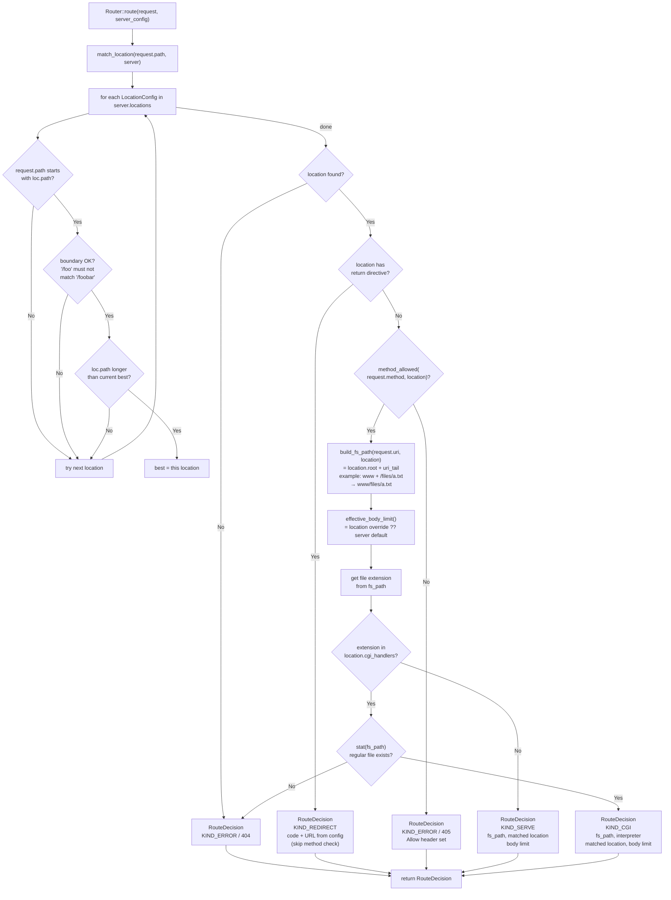
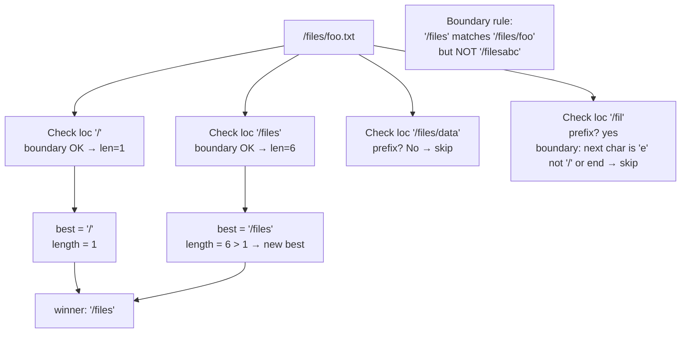

# Router — Request Routing

`Router::route()` maps an HTTP request to a `RouteDecision`.

```mermaid
flowchart TD
    ENTRY["Router::route(request, server_config)"] --> MATCH["match_location(request.path, server)"]

    MATCH --> LOOP["for each LocationConfig in server.locations"]
    LOOP --> PREFIX{"request.path starts\nwith loc.path?"}
    PREFIX -->|No| NEXT["try next location"]
    PREFIX -->|Yes| BOUND{"boundary OK?\n'/foo' must not\nmatch '/foobar'"}
    BOUND -->|No| NEXT
    BOUND -->|Yes| LONGER{"loc.path longer\nthan current best?"}
    LONGER -->|Yes| BEST["best = this location"]
    LONGER -->|No| NEXT
    NEXT --> LOOP
    LOOP -->|done| FOUND{"location found?"}

    FOUND -->|No| E404["RouteDecision\nKIND_ERROR / 404"]

    FOUND -->|Yes| REDIR{"location has\nreturn directive?"}
    REDIR -->|Yes| KREDIRECT["RouteDecision\nKIND_REDIRECT\ncode + URL from config\n(skip method check)"]

    REDIR -->|No| MCHECK{"method_allowed(\nrequest.method, location)?"}
    MCHECK -->|No| E405["RouteDecision\nKIND_ERROR / 405\nAllow header set"]

    MCHECK -->|Yes| FSPATH["build_fs_path(request.uri, location)\n= location.root + uri_tail\nexample: www + /files/a.txt\n→ www/files/a.txt"]

    FSPATH --> LIMIT["effective_body_limit()\n= location override ?? server default"]

    LIMIT --> CGIEXT["get file extension\nfrom fs_path"]
    CGIEXT --> HASCGI{"extension in\nlocation.cgi_handlers?"}

    HASCGI -->|No| KSERVE["RouteDecision\nKIND_SERVE\nfs_path, matched location\nbody limit"]

    HASCGI -->|Yes| EXISTS{"stat(fs_path)\nregular file exists?"}
    EXISTS -->|No| E404
    EXISTS -->|Yes| KCGI["RouteDecision\nKIND_CGI\nfs_path, interpreter\nmatched location, body limit"]

    E404 --> OUT["return RouteDecision"]
    KREDIRECT --> OUT
    E405 --> OUT
    KSERVE --> OUT
    KCGI --> OUT
```

## Location Matching Detail

```mermaid
flowchart TD
    PATH["/files/foo.txt"] --> L1["Check loc '/'\nboundary OK → len=1"]
    PATH --> L2["Check loc '/files'\nboundary OK → len=6"]
    PATH --> L3["Check loc '/files/data'\nprefix? No → skip"]
    PATH --> L4["Check loc '/fil'\nprefix? yes\nboundary: next char is 'e' not '/' or end → skip"]

    L1 --> BEST1["best = '/'\nlength = 1"]
    L2 --> BEST2["best = '/files'\nlength = 6 > 1 → new best"]

    BEST1 --> FINAL["winner: '/files'"]
    BEST2 --> FINAL

    note1["Boundary rule:\n'/files' matches '/files/foo'\nbut NOT '/filesabc'"]
```
