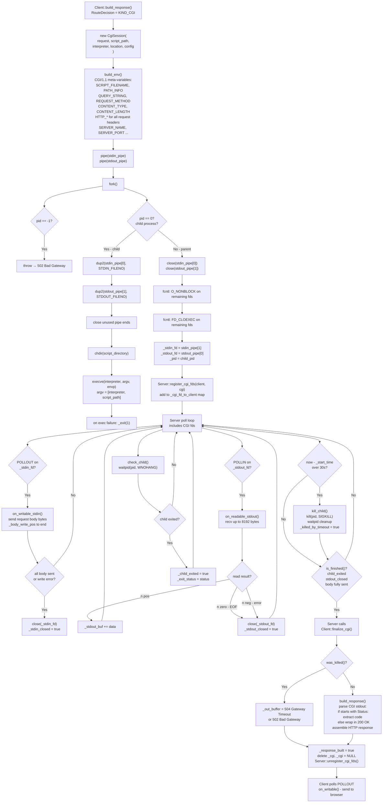

# CGI Session Lifecycle

`CgiSession` manages one CGI subprocess with async pipe I/O via poll.

```mermaid
flowchart TD
    START["Client::build_response()\nRouteDecision = KIND_CGI"] --> CONS["new CgiSession(\n  request, script_path,\n  interpreter, location, config\n)"]

    CONS --> ENV["build_env()\nCGI/1.1 meta-variables:\nSCRIPT_FILENAME, PATH_INFO\nQUERY_STRING, REQUEST_METHOD\nCONTENT_TYPE, CONTENT_LENGTH\nHTTP_* for all request headers\nSERVER_NAME, SERVER_PORT ..."]

    ENV --> PIPES["pipe(stdin_pipe)\npipe(stdout_pipe)"]
    PIPES --> FORK["fork()"]

    FORK --> PERR{"pid == -1?"}
    PERR -->|Yes| THROW["throw → 502 Bad Gateway"]

    FORK --> CHILD{"pid == 0?\nchild process?"}

    CHILD -->|Yes - child| C1["dup2(stdin_pipe[0], STDIN_FILENO)"]
    C1 --> C2["dup2(stdout_pipe[1], STDOUT_FILENO)"]
    C2 --> C3["close unused pipe ends"]
    C3 --> C4["chdir(script_directory)"]
    C4 --> C5["execve(interpreter, argv, envp)\nargv = [interpreter, script_path]"]
    C5 --> C6["on exec failure: _exit(1)"]

    CHILD -->|No - parent| P1["close(stdin_pipe[0])\nclose(stdout_pipe[1])"]
    P1 --> P2["fcntl: O_NONBLOCK on remaining fds"]
    P2 --> P3["fcntl: FD_CLOEXEC on remaining fds"]
    P3 --> P4["_stdin_fd = stdin_pipe[1]\n_stdout_fd = stdout_pipe[0]\n_pid = child_pid"]
    P4 --> REGFDS["Server::register_cgi_fds(client, cgi)\nadd to _cgi_fd_to_client map"]

    REGFDS --> POLLIO["Server poll loop\nincludes CGI fds"]

    POLLIO --> STDIN_EV{"POLLOUT on\n_stdin_fd?"}
    STDIN_EV -->|Yes| WS["on_writable_stdin()\nsend request body bytes\n_body_write_pos to end"]
    WS --> WSENT{"all body sent\nor write error?"}
    WSENT -->|Yes| CLOSEIN["close(_stdin_fd)\n_stdin_closed = true"]
    WSENT -->|No| POLLIO

    POLLIO --> STDOUT_EV{"POLLIN on\n_stdout_fd?"}
    STDOUT_EV -->|Yes| RS["on_readable_stdout()\nrecv up to 8192 bytes"]
    RS --> RSN{"read result?"}
    RSN -->|n pos| BUFOUT["_stdout_buf += data"]
    RSN -->|n zero - EOF| CLOSEOUT["close(_stdout_fd)\n_stdout_closed = true"]
    RSN -->|n neg - error| CLOSEOUT
    BUFOUT --> POLLIO
    CLOSEOUT --> POLLIO

    POLLIO --> WAITPID["check_child()\nwaitpid(pid, WNOHANG)"]
    WAITPID --> EXITED{"child exited?"}
    EXITED -->|Yes| SETEX["_child_exited = true\n_exit_status = status"]
    EXITED -->|No| POLLIO
    SETEX --> POLLIO

    POLLIO --> TIMEOUT{"now - _start_time\nover 30s?"}
    TIMEOUT -->|Yes| KILL["kill_child()\nkill(pid, SIGKILL)\nwaitpid cleanup\n_killed_by_timeout = true"]
    TIMEOUT -->|No| ISFINISHED

    KILL --> ISFINISHED

    ISFINISHED{"is_finished()?\nchild_exited\nstdout_closed\nbody fully sent"}
    ISFINISHED -->|No| POLLIO
    ISFINISHED -->|Yes| FINAL["Server calls\nClient::finalize_cgi()"]

    FINAL --> KILLED{"was_killed()?"}
    KILLED -->|Yes| E504["_out_buffer = 504 Gateway Timeout\nor 502 Bad Gateway"]
    KILLED -->|No| BUILD["build_response()\nparse CGI stdout:\n  if starts with Status: extract code\n  else wrap in 200 OK\nassemble HTTP response"]

    E504 --> DONE["_response_built = true\ndelete _cgi, _cgi = NULL\nServer::unregister_cgi_fds()"]
    BUILD --> DONE

    DONE --> SENDOUT["Client polls POLLOUT\non_writable() - send to browser"]
```
