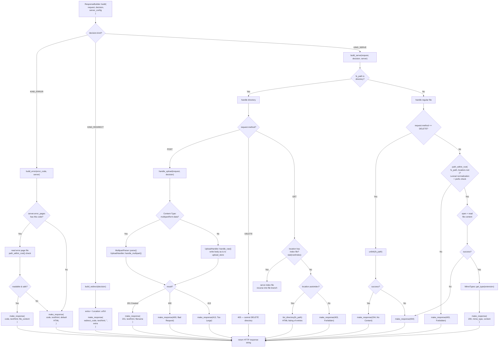
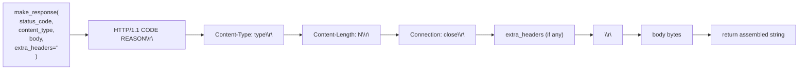

# Response Builder

`ResponseBuilder::build()` — assembles the HTTP response for non-CGI requests.

```mermaid
flowchart TD
    ENTRY["ResponseBuilder::build(\n  request, decision, server_config\n)"] --> KIND{"decision.kind?"}

    KIND -->|KIND_ERROR| ERRB["build_error(error_code, server)"]
    KIND -->|KIND_REDIRECT| REDB["build_redirect(decision)"]
    KIND -->|KIND_SERVE| SERVB["build_serve(request, decision, server)"]

    ERRB --> CUSTPAGE{"server.error_pages\nhas this code?"}
    CUSTPAGE -->|Yes| READEP["read error page file\npath_within_root() check"]
    READEP --> EPOK{"readable & safe?"}
    EPOK -->|Yes| CUSTH["make_response(\n  code, text/html, file_content\n)"]
    EPOK -->|No| DEFHTML["make_response(\n  code, text/html, default HTML\n)"]
    CUSTPAGE -->|No| DEFHTML

    REDB --> REDIR["extra = 'Location: url\\r\\n'\nmake_response(\n  redirect_code, text/html, '', extra\n)"]

    SERVB --> ISDIR{"fs_path is\ndirectory?"}

    ISDIR -->|Yes| DIRB["handle directory"]
    ISDIR -->|No| FILEB["handle regular file"]

    DIRB --> METH{"request.method?"}
    METH -->|POST| UPL["handle_upload(request, decision)"]
    METH -->|DELETE| DEL_DIR["405 — cannot DELETE directory"]
    METH -->|GET| INDEX{"location has\nindex file?\nstat(root/index)"}
    INDEX -->|Yes| SERVE_IDX["serve index file\nrecurse into file branch"]
    INDEX -->|No| AUTO{"location.autoindex?"}
    AUTO -->|Yes| DIRLIST["list_directory(fs_path)\nHTML listing of entries"]
    AUTO -->|No| F403["make_response(403, Forbidden)"]

    FILEB --> DELMETH{"request.method == DELETE?"}
    DELMETH -->|Yes| UNLINK["unlink(fs_path)"]
    UNLINK --> ULR{"success?"}
    ULR -->|Yes| F204["make_response(204, No Content)"]
    ULR -->|No| F404["make_response(404)"]

    DELMETH -->|No| SAFE{"path_within_root(\n  fs_path, location.root\n)?\nLexical normalization\n+ prefix check"}
    SAFE -->|No| F403B["make_response(403, Forbidden)"]
    SAFE -->|Yes| READ{"open + read\nfile content"}
    READ --> ROK{"success?"}
    ROK -->|No| F404
    ROK -->|Yes| MIME["MimeTypes::get_type(extension)"]
    MIME --> F200["make_response(\n  200, mime_type, content\n)"]

    UPL --> ULTYPE{"Content-Type:\nmultipart/form-data?"}
    ULTYPE -->|Yes| MULTI["MultipartParser::parse()\nUploadHandler::handle_multipart()"]
    ULTYPE -->|No| RAW["UploadHandler::handle_raw()\nwrite body as-is to upload_store"]
    MULTI --> ULRES{"result?"}
    RAW --> ULRES
    ULRES -->|201 Created| F201["make_response(\n  201, text/html, filename\n)"]
    ULRES -->|400| F400["make_response(400, Bad Request)"]
    ULRES -->|413| F413["make_response(413, Too Large)"]

    CUSTH --> OUT["return HTTP response string"]
    DEFHTML --> OUT
    REDIR --> OUT
    F200 --> OUT
    F201 --> OUT
    F204 --> OUT
    F400 --> OUT
    F403 --> OUT
    F403B --> OUT
    F404 --> OUT
    F413 --> OUT
    DIRLIST --> OUT
    DEL_DIR --> OUT
```

## make_response Assembly

```mermaid
flowchart LR
    MR["make_response(\n  status_code,\n  content_type,\n  body,\n  extra_headers=''\n)"] --> SL["HTTP/1.1 CODE REASON\\r\\n"]
    SL --> CH["Content-Type: type\\r\\n"]
    CH --> CL["Content-Length: N\\r\\n"]
    CL --> CONN["Connection: close\\r\\n"]
    CONN --> EH["extra_headers (if any)"]
    EH --> BLANK["\\r\\n"]
    BLANK --> BODY["body bytes"]
    BODY --> RESP["return assembled string"]
```
