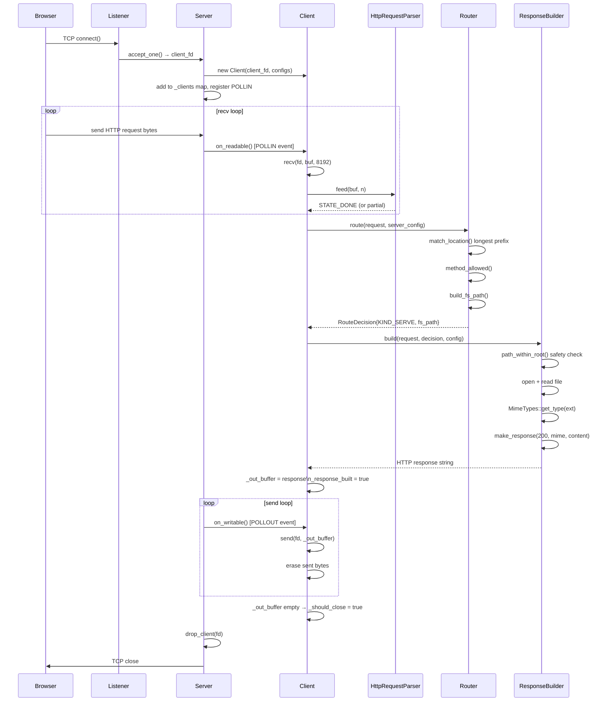
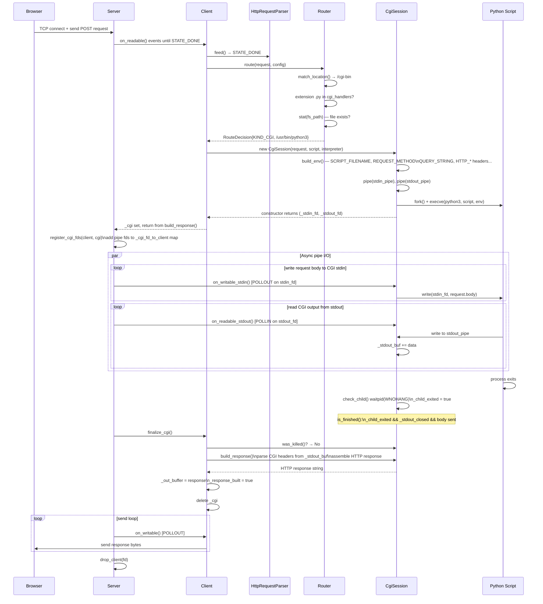
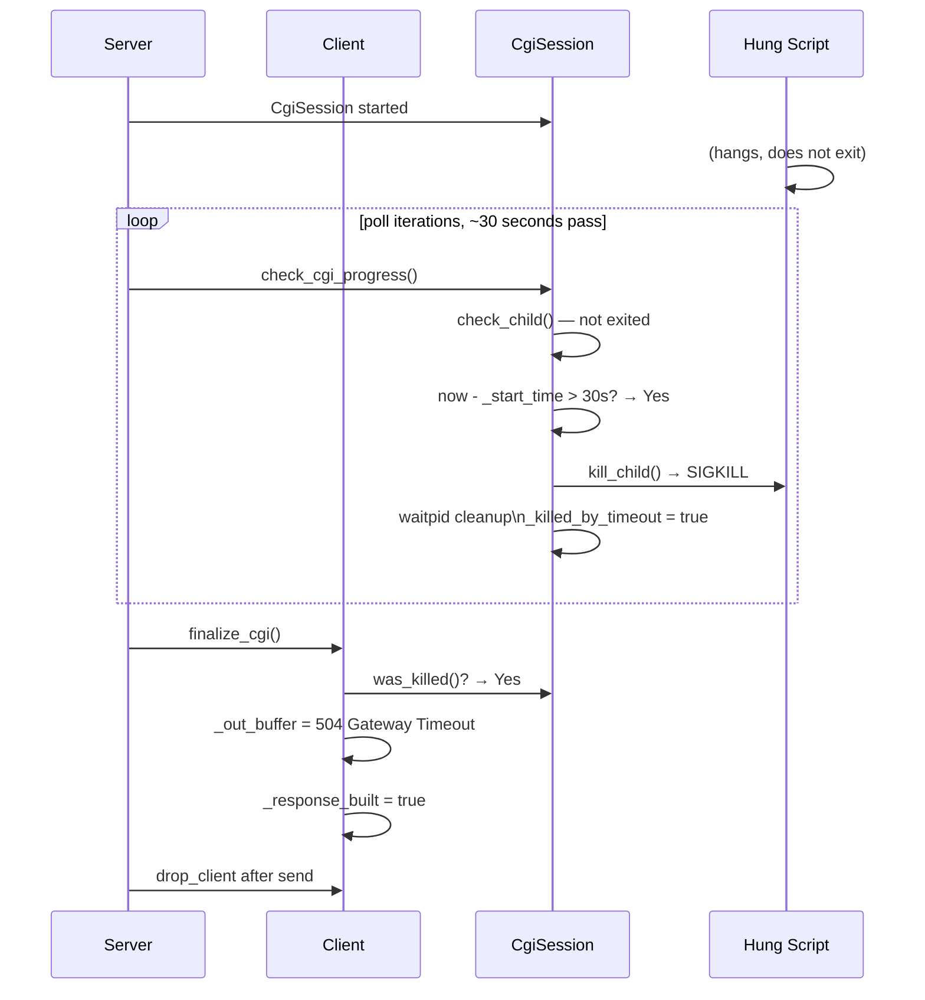
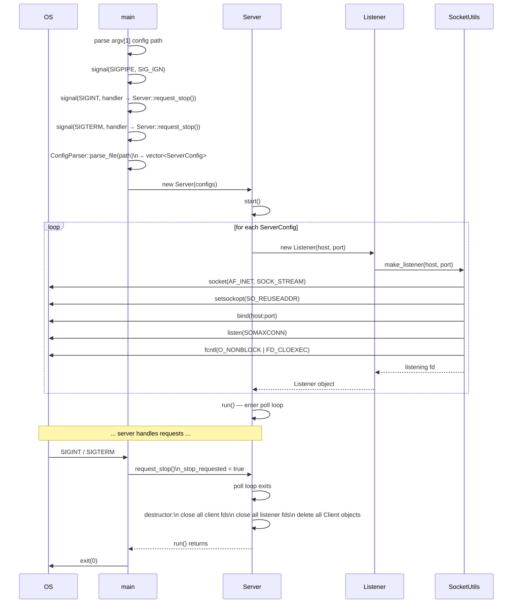

# Full Request–Response Sequence Diagram

End-to-end sequence for a static file request, a CGI request, and an upload.

## Static File Request (GET /index.html)



## CGI Request (POST /cgi-bin/form.py)



## CGI Timeout (> 30 seconds)



## File Upload (POST /upload with multipart/form-data)

```mermaid
sequenceDiagram
    participant Browser
    participant Server
    participant Client
    participant Parser as HttpRequestParser
    participant Router
    participant Builder as ResponseBuilder
    participant UploadHandler
    participant MultipartParser

    Browser->>Server: POST /upload HTTP/1.1\nContent-Type: multipart/form-data; boundary=XYZ\nContent-Length: N\n\n--XYZ\nContent-Disposition: form-data; name="file"; filename="cat.jpg"\n\n<binary data>--XYZ--

    Server->>Client: on_readable() events
    Client->>Parser: feed() — STATE_BODY_LENGTH\n(Content-Length → read N bytes into body)
    Parser-->>Client: STATE_DONE

    Client->>Router: route(POST /upload, config)
    Router->>Router: match_location() → /upload\nmethod POST allowed\nbuild_fs_path() → www/uploads
    Router-->>Client: RouteDecision{KIND_SERVE, www/uploads/}

    Client->>Builder: build(request, decision)
    Builder->>Builder: fs_path is directory + POST?
    Builder->>UploadHandler: handle(request, upload_store, body_limit)

    UploadHandler->>UploadHandler: Content-Type: multipart/form-data?
    UploadHandler->>MultipartParser: parse(body, boundary)
    MultipartParser->>MultipartParser: split parts by boundary\nextract Content-Disposition\nget filename

    MultipartParser-->>UploadHandler: UploadPart{filename, data}
    UploadHandler->>UploadHandler: sanitize_filename()\ncheck body_limit
    UploadHandler->>UploadHandler: open(upload_store/filename, write)\nwrite part.data
    UploadHandler-->>Builder: UploadResult{201, "cat.jpg"}

    Builder->>Builder: make_response(201, text/html, "Uploaded: cat.jpg")
    Builder-->>Client: HTTP/1.1 201 Created ...

    Client->>Client: _out_buffer = response
    Server->>Client: on_writable() → send to browser
    Browser->>Browser: receives 201 Created
```

## Server Startup and Shutdown


