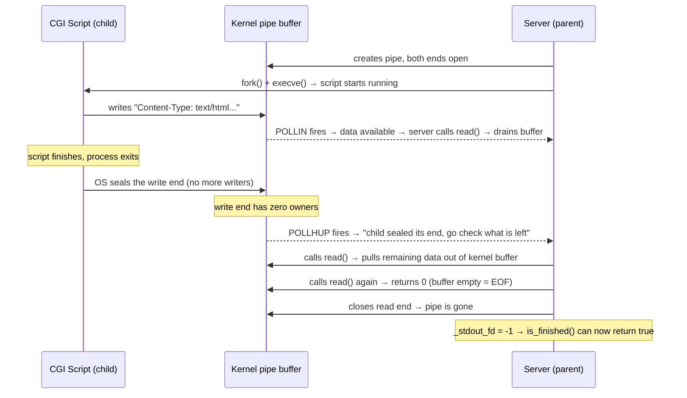

# POLLHUP on the CGI stdout pipe

`POLLHUP` fires on the server's read end of the stdout pipe when the child process
closes its write end (usually on exit). It does **not** mean the pipe buffer is empty —
data may still be sitting in the kernel buffer waiting to be read.

## Key distinction

| Event | What it means |
|-------|--------------|
| `POLLIN` | Data is in the kernel buffer right now — come read it |
| `POLLHUP` | Child sealed its end — no new data ever, but buffer may still have bytes |
| `read()` returns `0` | Buffer is fully empty — you got everything |

That is why `handle_cgi_event()` triggers `on_readable_stdout()` on **both** `POLLIN`
and `POLLHUP` — after the child exits you still need to drain whatever is left in the
buffer before closing the fd.