# Poll Events: POLLIN, POLLOUT, POLLHUP

## What is poll()?

`poll()` is a system call that lets the server **wait** for activity on multiple file
descriptors at once, without wasting CPU in a busy loop.

Think of it like a hotel receptionist watching many phones at once. Instead of
constantly asking "is there a call?", they just sit and wait — the moment any phone
rings, they handle it.

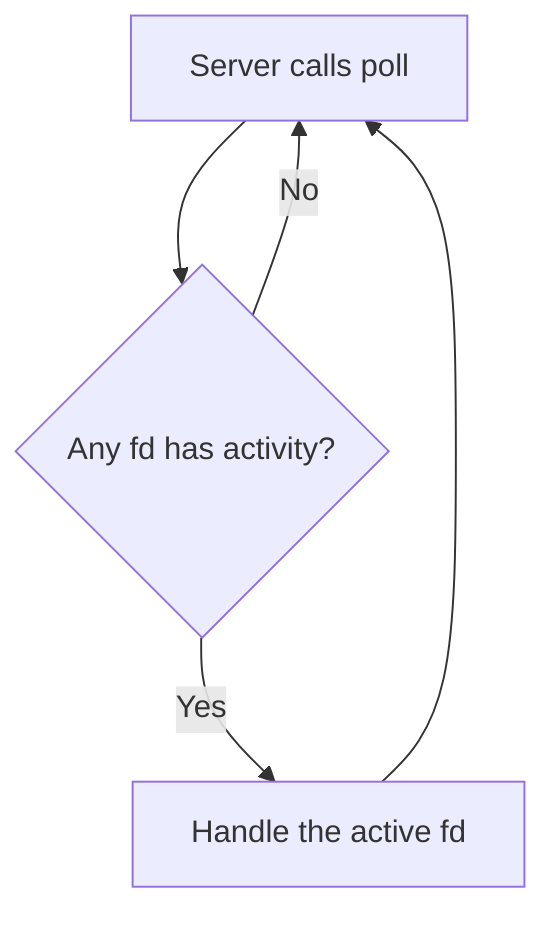

---

## The Three Events

| Event | Meaning | Analogy |
|-------|---------|---------|
| `POLLIN` | Data is ready to **read** | Your mailbox has letters in it |
| `POLLOUT` | Space is available to **write** | Your outbox has room for more letters |
| `POLLHUP` | The other side **hung up** / closed the connection | The other person put down the phone |

---

## Who Has What File Descriptors?

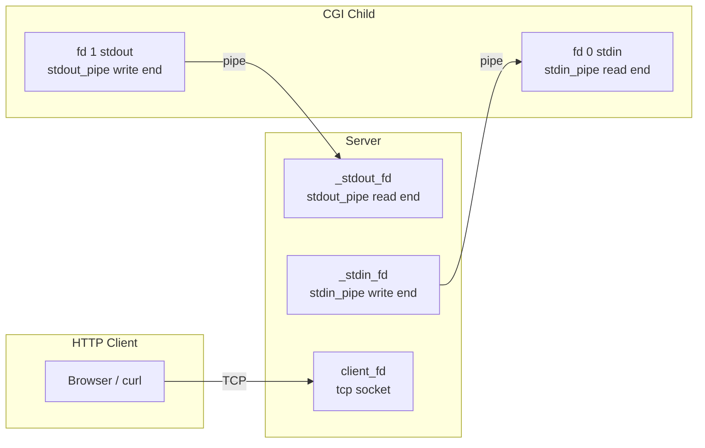

---

## POLLIN — Data is Ready to Read

### What triggers it?
The kernel raises POLLIN on a fd when bytes appear in its buffer.

### On `client_fd` (HTTP client → Server)
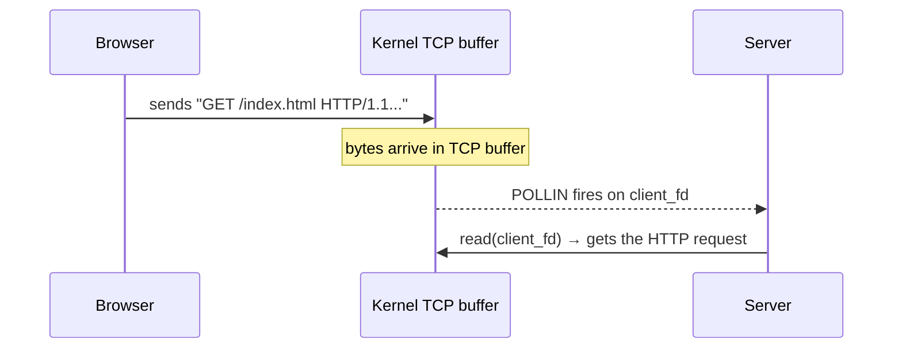

**In code:** `Server.cpp` — `if (revents & POLLIN)` on the client socket,
the server reads the incoming HTTP request.

### On `_stdout_fd` (CGI → Server)
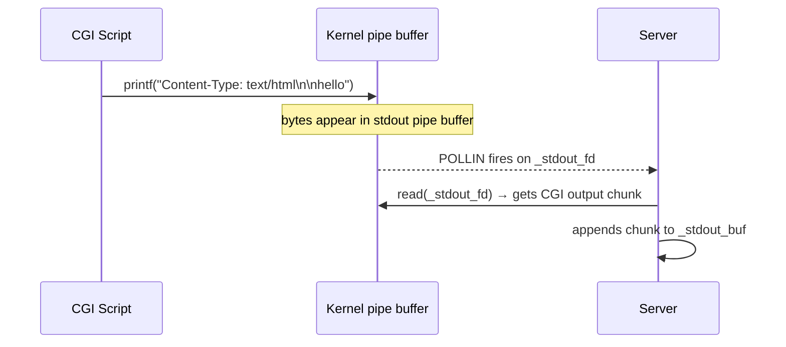

**In code:** `CgiSession.cpp` — `read(_stdout_fd, buf, sizeof(buf))`
inside `on_readable_stdout()`.

### Summary table

| fd | Who writes into it | Who gets POLLIN |
|----|-------------------|-----------------|
| `client_fd` | Browser / HTTP client | Server |
| `_stdout_fd` | CGI child (its fd 1) | Server |

---

## POLLOUT — Space Available to Write

### What triggers it?
The kernel raises POLLOUT when the buffer has room and you can write without blocking.

### On `client_fd` (Server → Browser)
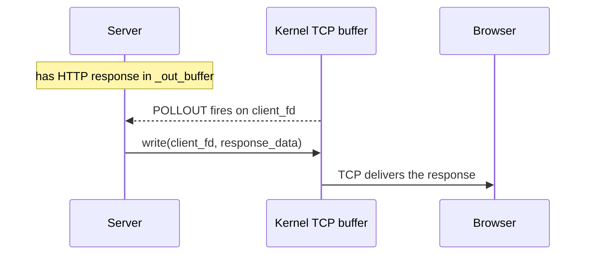

**In code:** `Server.cpp` — `if (revents & POLLOUT)` on client socket,
server writes from `_out_buffer` to the client.

### On `_stdin_fd` (Server → CGI)
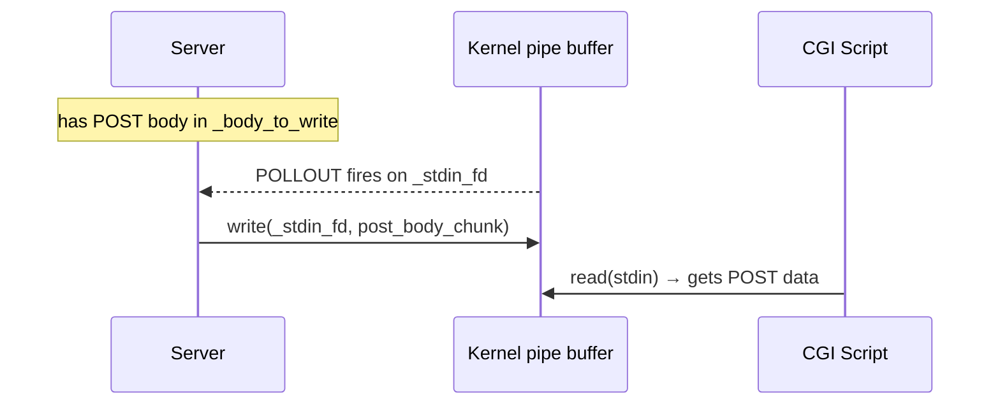

**In code:** `CgiSession.cpp` — `write(_stdin_fd, ...)` inside
`on_writable_stdin()`. Keeps firing until all POST body is sent, then
`_stdin_fd` is closed to signal EOF to the CGI.

### Why not always ask for POLLOUT?

If the server registers POLLOUT even when it has nothing to send, `poll()` returns
immediately every loop — burning 100% CPU doing nothing. So POLLOUT is only
registered when there is actually data waiting to be written.

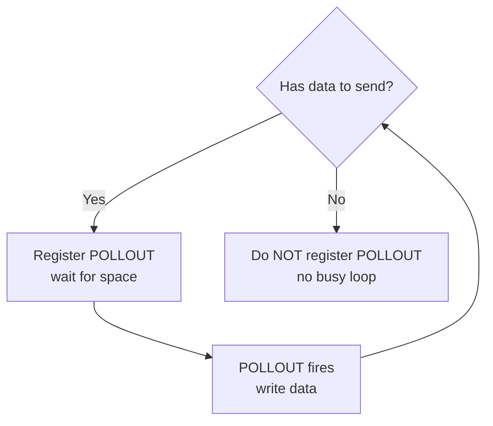

### Summary table

| fd | Who fills the buffer | Who gets POLLOUT |
|----|---------------------|-----------------|
| `client_fd` | Server (`_out_buffer`) | Server |
| `_stdin_fd` | Server (`_body_to_write`) | Server |

---

## POLLHUP — The Other Side Closed

### What triggers it?
When all writers on a pipe close their end, the kernel marks the read end with POLLHUP.
On a TCP socket, it fires when the remote peer closes the connection.

### On `client_fd` (Browser disconnects)
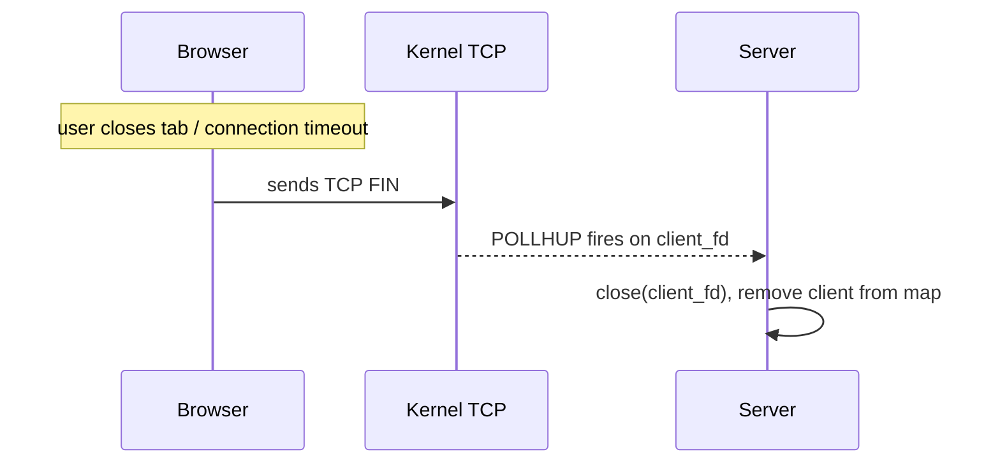

**In code:** `Server.cpp` — `if (revents & (POLLHUP | POLLERR | POLLNVAL))`
on client socket → client is removed.

### On `_stdout_fd` (CGI exits)
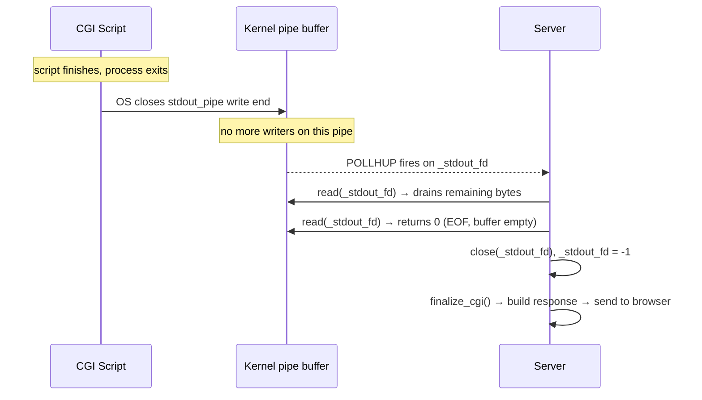

**In code:** `Server.cpp` — POLLHUP on `stdout_fd` triggers
`on_readable_stdout()` which drains the pipe then sets `_stdout_fd = -1`.

### On `_stdin_fd` (CGI closed its stdin early)
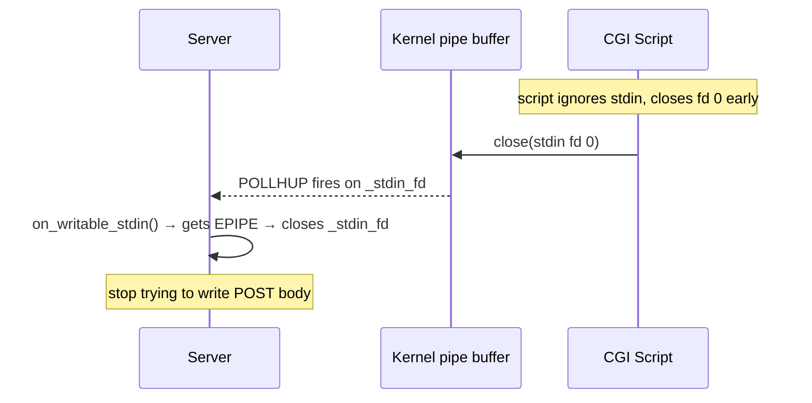

**In code:** `Server.cpp` — POLLHUP on `_stdin_fd` → calls
`on_writable_stdin()` which gets `n <= 0` and closes the fd gracefully.

### Summary table

| fd | What causes POLLHUP | What server does |
|----|--------------------|--------------------|
| `client_fd` | Browser disconnects | Remove client, free memory |
| `_stdout_fd` | CGI exits | Drain pipe, build response, send to browser |
| `_stdin_fd` | CGI closes stdin early | Stop writing POST body, continue normally |

---

## Full Event Flow: CGI Request End to End

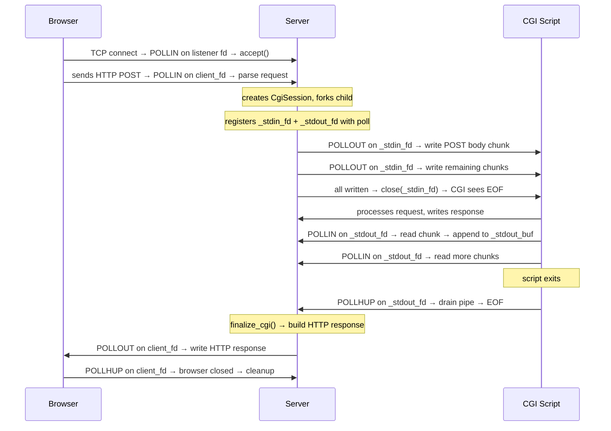

---

## All Events at a Glance

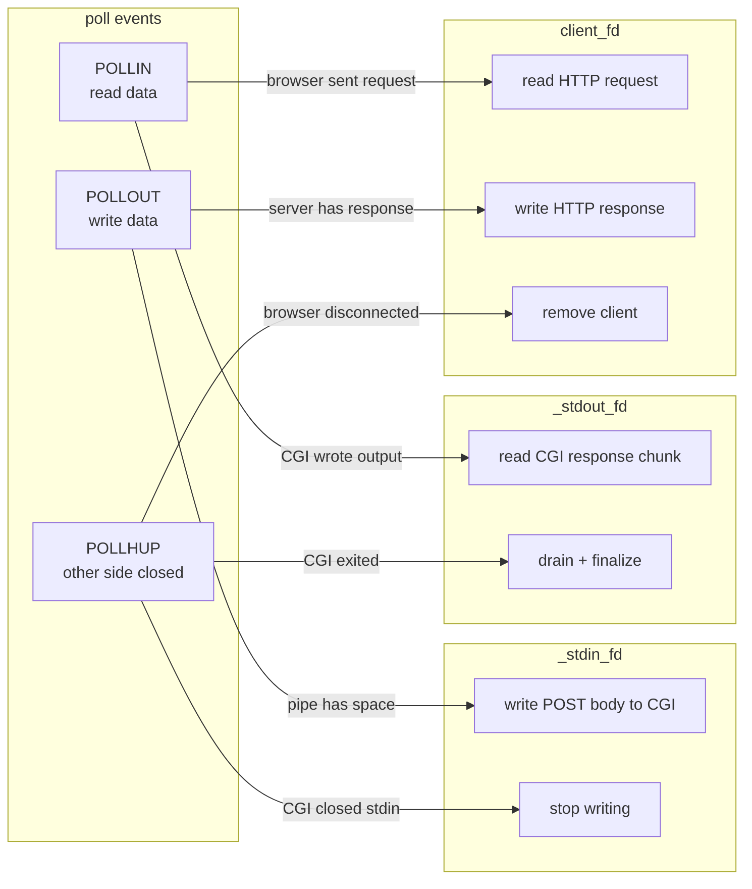

| Event | `client_fd` | `_stdin_fd` | `_stdout_fd` |
|-------|------------|------------|-------------|
| `POLLIN` | Read HTTP request from browser | — | Read CGI output chunk |
| `POLLOUT` | Write HTTP response to browser | Write POST body to CGI | — |
| `POLLHUP` | Browser disconnected → cleanup | CGI closed stdin early → stop writing | CGI exited → drain pipe → finalize |
